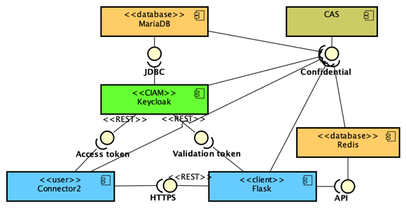
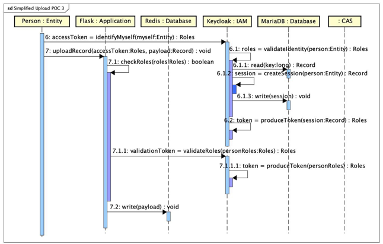

# Public - Master of Science Thesis on Confidential Identity and Access Management

This is a public version of the work carried out for the production of a master's thesis in distributed systems engineering at the Technische Universität Dresden
(TUD) on a confidential identity and access management system and defended in February 2023 by **Andre Miguel**.

## Motivation

As a person, we have guaranteed by law the right to privacy in many countries. Exceptions
to this right are also determined by the law and executed upon court authorization. Many
businesses and governments possess portions of private information of persons with whom
they interact (also called 
_Personally Identifiable Information_
\[[DOL\_22](https://www.dol.gov/general/ppii "Department of Labor, United States of America 2022. Guidance on the Protection of Personal Identifiable Information. accessed 12-December-2022")\]
– PII – to correctly
provide services to them or to demand certain obligations. These organizations must protect
the sensitive information they possess of the individuals and handle them appropriately to
avoid leaking or misuse. Therefore, access to this set or even parts of the information they
store is subject to control and appropriate restrictions. This is a subject of particular
interest to the public and is addressed by governments worldwide

Two cases of legislation for
regulation and enforcement are worth mentioning: Germany’s and Brazil’s legal frameworks.
Germany adopts two complimentary legal frameworks: the supranational
_General Data Protection Regulation (GDPR) 2016/679_
\[[GDPR\_22](https://gdpr.eu/what-is-gdpr "What is GDPR, the EU’s new data protection law?. accessed 12-December-2022")\],
the European Union’s data protection law;
and the national _Federal Data Protection Act_ of 30 June 2017, which implements the
GDPR but does not overlap it, as it states in I.1.1.5 
\[[FOJG\_17](https://www.gesetze-im-internet.de/englisch_bdsg/englisch_bdsg.html "Federal Office of Justice of Germany (2017). Federal Data Protection Act of 30 June 2017 (Federal Law Gazette I p. 2097), as last amended by Article 10 of the Act of 23 June 2021 (Federal Law Gazette I, p. 1858; 2022 I p. 1045). accessed 12-December-2022")\].
And Brazil has its own legal framework providing for data processing and protection, the 
_General Data Protection Law_ 2018
\[[LDFSL\_18](https://www.pnm.adv.br/wp-content/uploads/2018/08/Brazilian-General-Data-Protection-Law.pdf "Ronaldo Lemos; Daniel Douek; Sofia Lima Franco; Ramon Alberto dos Santos; Natalia Langenegger (2018). General Data Protection Law. Law No. 13,709, of August 14, 2018 - and changes Law No. 12,965, of April 23, 2014. accessed 12-December-2022")\]
which is compatible with GDPR
\[[OlHe\_21](https://www.ibanet.org/electronic-medical-records-brazil "Renata Fialho de Oliveira, Isabel Hering (2021). Electronic medical records in Brazil: the pursuit of balance between healthcare improvement and patient data protection, on October 1, 2021. International Bar Association. accessed 12-December-2022")\].

Official regulations are mandatory but, in spite of that, not every organization complies
properly with them and episodes like the leakage of people’s private information are frequent
(e.g. the leakage of citizen’s fiscal data from government agencies
\[[Land\_21](https://mlandimadv.jusbrasil.com.br/artigos/1163835014/tudo-que-voce-precisa-saber-sobre-o-vazamento-de-dados-de-223-milhoes-de-brasileiros "Mariana Landim (2021). TUDO que você precisa saber sobre o vazamento de dados de 223 milhões de brasileiros, on February 5, 2021. Jusbrasil. accessed 12-December-2022")\],
\[[Belli\_21](https://www.opendemocracy.net/en/largest-personal-data-leakage-brazilian-history/ "Luca Belli (2021). The largest personal data leakage in Brazilian history, on February 3, 2021. Open Democracy. accessed 12-December-2022")\],
\[[Stat\_22](https://www.statista.com/statistics/1200138/data-leak-government-brazil/#:~:text=On%20January%2019%2C%202021%2C%20a,of%20Brazil’s%20Ministry%20of%20Health./ "Statista (2022). Key figures on the data leakage of the website of the Ministry of Health in Brazil in January 2021, on May 19, 2022. Statista. accessed 12-December-2022")\],
and many others more.

This topic has had growing importance, with the proliferation of systems and services digging
the internet to trace users’ behavior at expense of their privacy. However, despite this
can be overcome by "not accepting cookies" in a browser (and hopefully not being tracked),
other major aspects are much more critical, like data leaks from government agencies or
large enterprises. Whether either data or the systems are hosted and managed by a third-
party entity, say, a cloud provider, or on the premises, the risk remains: unauthorized access
to sensitive data or processes can expose people’s privacy or put lives at risk

## The thesis

The work of this research started from the assumption that the Identity and Access Management
system — IAM — is leveraged to be fully confidential (Confidential Identity and Access Management — CIAM),
hosted by a cloud provider, and operated in a service-oriented
architecture. Therefore, the ultimate objective is to determine if and how a cloud provider
can take control of the CIAM or compromise its integrity while continuing to operate as if
everything is normal.

The approach taken to carry out the research was applied research, where the goal set was
implementing an IAM, covering protection goals of confidentiality and integrity, within the
framework determined by the confidential computing platform, and, henceforth, each new step
was empirically adjusted and improved based on the previous advancements.

### Base software chosen

* Identity and Access Management system: [Keycloak](https://www.keycloak.org/ "Open Source Identity and Access Management")
* Confidential Computing platform: [SCONE](https://scontain.com/ "Secure CONtainer Environment")

### Composing the software solution
* MariaDB
* Flask
* Redis
* NFS
* Bind
* Connector2
* Configuration and Attestation Service — CAS

## Keycloak advantages
* Protects access to other applications
  * Applications will outsource user management and access control to Keycloak
  * Control identities and their corresponding permissions within specific domains of serviced applications
  * Role-Based Access Control mechanism: RBAC has fine-grained settings, such as to grant or deny access to specific areas and resources
* Protocols and data structures in Keycloak
  * OAuth 2.0 / OpenID Connect — OIDC
  * SAML
  * RESTful
  * Passkeys
  * JSON
  * JSON Web Token — JWT
* Means to use and integrate Keycloak
  * Website management interface
  * Directory services
  * Identity federation

## Developing the solution
### System development and configuration
* A Python application was created to provide a web server in Flask, receiving REST commands to load persistent information onto a Redis
* It runs attested and all configuration and secrets is obtained from CAS

##### • UML Components Diagram - CIAM with applications

* Keycloak persists data in MariaDB
  * Realms, clients, roles, users, all configurations to support outsourcing user management
* Flask persists data in Redis
  * The application produced will upload a JSON payload onto Redis and it is permanent
  * A second record is created, of **ephemeral** type, with username, access token, and expiration time
     * this can be used by a second application, such as auditing or governance, to recover traceability
 * A Java client application was produced to handle different user authentication mechanisms, such as RESTful communication, and via login webpage provided by Keycloak

##### • UML Sequence Diagram - Upload records (simplified)

